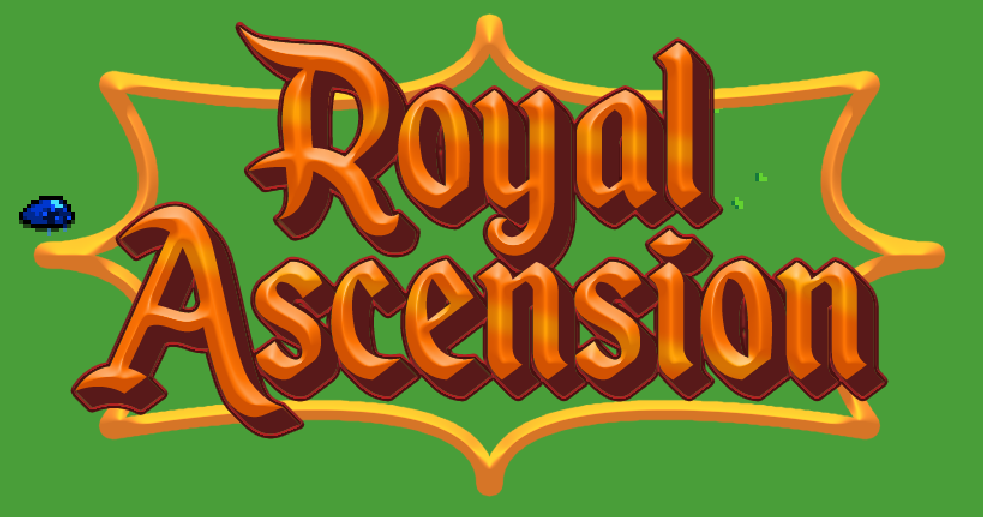
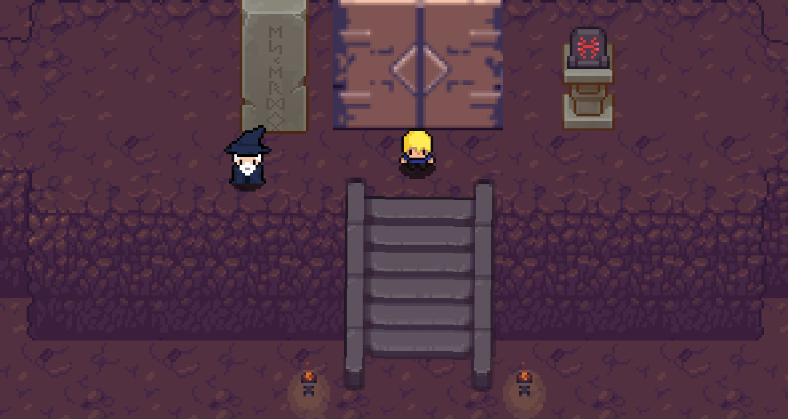
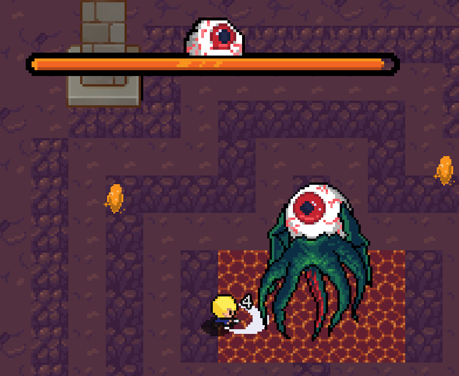
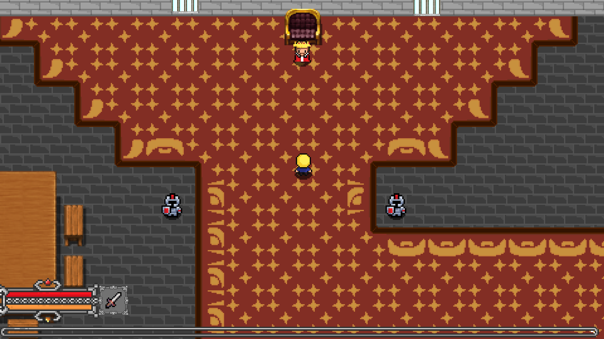
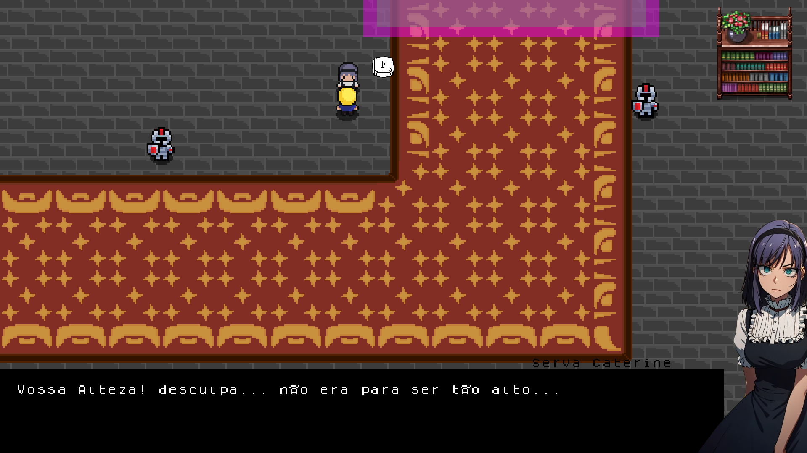

# ROYAL ASCENSION
👨‍🏫JOGO 2D, DE AVENTURA E RPG, FEITO NO GAME MAKER STUDIO.

   
  
  
  
  

## DESCRIÇÃO:
Um jogo de RPG focado na historia do personagem principal, Nicholas é o principe de EverHart, Sua jornada começa quando ele descobre que seu pai (O Rei) est muito doente e um antigo amigo de seu pai, o bruxo Lucius oferece a solução para ele, enfrentar os 4 reinos elementais e coletar o elixir elemental de cada reino, assim formando o elixir da vida para curar o rei. Assim o principe Nicholas vai em busca dos elixis com ajuda do bruxo Lucius.

## IMPORTANDO PARA O GAME MAKER STUDIO:
### MÉTODO 1: IMPORTAR VIA PACOTE DE RECURSOS (.gml):
   - No GameMaker Studio, vá para `Importar Recursos` no menu de Arquivo.
   - Navegue até o arquivo `.gml` ou pacote de recursos que você baixou e selecione-o.
   - Clique em `Importar` para adicionar o conteúdo ao seu projeto.

### MÉTODO 2: COPIAR E COLAR MANUALMENTE:
1. **Copiar o Código e Assets:**
   - Extraia o conteúdo do repositório GitHub (se ainda não o fez) em uma pasta no seu computador.
   - Navegue até a pasta de recursos do seu projeto GameMaker (Em `./CODIGO`).

2. **Adicionar o Conteúdo ao Projeto:**
   - Copie a pasta contendo o código e assets do repositório GitHub.
   - Cole a pasta na pasta de recursos do seu projeto GameMaker. O GameMaker Studio reconhecerá e importará automaticamente os arquivos.

### CONFIGURAR O PROJETO NO GAME MAKER STUDIO:
1. **Abrir a Cena Principal:**
   - No painel `Recursos`, vá para a pasta onde o código e assets foram importados. Procure por uma cena principal, em `./CODIGO/rooms`.
   - Clique duas vezes na cena para abri-la.

2. **Verificar e Ajustar Configurações:**
   - Certifique-se de que todos os scripts, objetos e outros recursos foram importados corretamente.
   - Se houver scripts que precisam de referências, você pode precisar arrastar e soltar esses objetos no `Inspector` para configurar as referências corretamente.
   
## NÃO SABE?
- Entendemos que para manipular arquivos em muitas linguagens e tecnologias relacionadas, é necessário possuir conhecimento nessas áreas. Para auxiliar nesse aprendizado, oferecemos cursos gratuitos disponíveis:
* [CURSO DE GAME MAKER](https://github.com/VILHALVA/CURSO-DE-GAME-MAKER)
* [CURSO DE GML](https://github.com/VILHALVA/CURSO-DE-GML)
* [CONFIRA MAIS CURSOS](https://github.com/VILHALVA?tab=repositories&q=+topic:CURSO)

## CREDITOS:
- [PROJETO CRIADO PELO "DhominySan"](https://github.com/DhominySan/Royal-Ascension)
- [PROJETO EDITADO PELO VILHALVA](https://github.com/VILHALVA)
